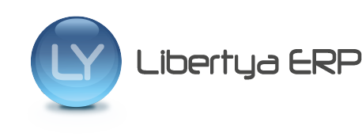

Libertya es un poderoso ERP con toda su funcionalidad desarrollada y distribuida como software libre; está basado en tecnología multiplataforma, y es completamente personalizable y adaptable a las necesidades de cualquier empresa. Su arquitectura y componentes son totalmente escalables. Además, está diseñado para ser integrado fácilmente con cualquier ecosistema de software pre-existente.

**Beneficios que diferencian a Libertya**

* La empresa usuaria posee un completo control de su implementación sin estar obligada a convenios de mantenimiento obligatorios.
* El código del producto y toda su documentación asociada están disponibles desde un primer momento.
* Independencia total del proveedor y acceso permanente de una numerosa y dinámica comunidad de usuarios.
* Capacitación integral y asesoramiento profesional incluyendo - en caso de ser de interés - el diseño de su arquitectura interna y detalles constructivos del producto.
* Componentes y aplicaciones complementarias especialmente diseñadas para extender e integrar Libertya a otros productos de software.

**Licencia**

Libertya ERP es un Software de Gestión Libre regulado por la licencia LPLB 1.0 (Licencia Pública Libertya versión 1.0) mediante la cual el producto puede ser utilizado sin costo de licencias con el 100% de la funcionalidad disponible.

**Código abierto**

Código abierto (del inglés open source) es el término con el que se conoce al software distribuido y desarrollado libremente. Fue utilizado por primera vez en 1998 por algunos usuarios de la comunidad del software libre, tratando de usarlo como reemplazo al ambiguo nombre original en inglés del software libre (free software).