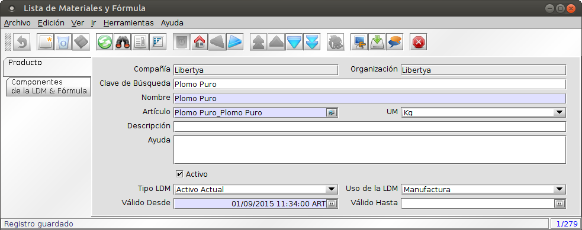
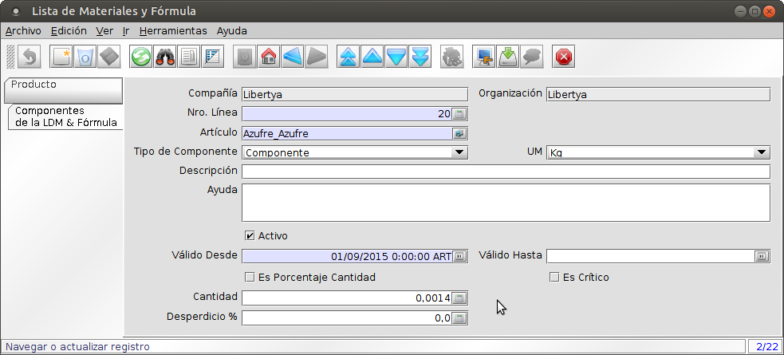

Las Listas de Materiales (LDM) permiten definir la composición de los productos fabricados, tanto intermedios como  terminados. Se pueden tener distintos niveles intermedios de producción, los  niveles intermedios definen la fabricación de productos que serán entrada de otros procesos productivos de niveles superiores.

Lista de materiales y fórmulas
------------------------------

1. Acceder a la opción de menú **Gestión de Manufactura → Gestión de Ingeniería → Lista de Materiales y Fórmulas → Lista de Materiales y Fórmula**. El sistema presenta una ventana como lo muestra la Imagen Ing005.
2. Campos a ingresar en la cabecera:
	* **Compañía:** Cliente para esta instalación compañía o entidad legal 
	* **Organización:** Entidad organizacional dentro de la compañía. Una organización es una unidad de la compañía o entidad legal.
	* **Nombre:** Identificador alfanumérico de la entidad. El nombre de una entidad (registro) se usa como una opción de búsqueda predeterminada adicional a la clave de búsqueda. El nombre es de hasta 60 caracteres de longitud. 
	* Artículo:** Producto que va a tener una fórmula asociada.
	* **UM:** Unidad de Medida se refiere a unidades de medida no monetarias y además define si se permite la conversión entre unidades de medida y cómo se van a calcular.
	* **Descripción:** Descripción corta opcional del registro Una descripción esta limitada a 255 caracteres.
	* **Ayuda:** El campo Ayuda contiene una sustento, comentario o ayuda acerca de cómo usar este ítem. 
	* **Activo:** El registro está activo en el sistema Hay dos métodos para que los registros no estén disponibles en el sistema: Uno es eliminar el registro; el otro es desactivarlo. Un registro desactivado no está disponible para selección; pero está disponible para Informes 
	* **Aviso de Cambio:** Cuenta de materiales (ingeniería) cambio de aviso (versión).
	* **Nro del Documento:** Número de secuencia del documento para cada documento creado. El número del documento es usualmente generado en automático por el sistema y determinado por el tipo del documento. Si el documento no se salva; el número preliminar se despliega entre "<>".
	* **Tipo LDM:** Tipo de Lista de Materiales.
	* **Uso de la LDM:** Sector de uso de lista de materiales. El predeterminado de la LDM es Manufactura.
	* **Válido Desde:** Inicio del período de validez del registro.
	* **Válido Hasta:** Fin del período de validez del registro.

3. Guardar.

Imagen Ing005: Lista de Materiales

Lista de materiales y fórmulas - Componentes
--------------------------------------------

1. Acceder a la opción de menú **Gestión de Manufactura → Gestión de Ingeniería → Lista de Materiales y Fórmulas → Lista de Materiales y Fórmula**. El sistema presenta una ventana como lo muestra la Imagen Ing005. Seleccionar la pestaña **Componentes de la LDM & Fórmula**, el sistema presenta una ventana como lo muestra la Imagen Ing006.
2. Campos a ingresar:
	* **Compañía:** Cliente para esta instalación compañía o entidad legal 
	* **Organización:** Entidad organizacional dentro de la compañía. Una organización es una unidad de la compañía o entidad legal.
	* **No. Línea:** Indica el Número de Línea único y controlará el orden de despliegue de las líneas dentro de un documento. Lo define el sistema de forma automática.
	* **Artículo:** Identifica un elemento/producto que es parte de una lista de materiales.
	* **Tipo de componente:**
		* Componente: identifica a una materia prima, ingrediente, parte o subproducto que es utilizado en el ensamblado de un proceso de fabricación superior.
		* Co producto: esta entidad no es un producto programado obtenido como consecuencia de otro proceso de producción. Permite el ingreso a stock de subproductos derivados de la producción.
		* Empaque: este producto no será tenido en cuenta para calcular la cantidad total de componentes cuando la opción “Es Porcentaje Cantidad” se encuentre seleccionado.
		* Fantasma: indica que el producto es un ensamble ficticio, esto es, un conjunto de componentes que se agrupan sólo para hacer más fácil el análisis de forma separada del resto de la LDM. Cuando el MRP genera un requerimiento del fantasma y lo proyectado no está disponible, el proceso va al nivel mínimo y comienza un nuevo ciclo de MRP pero sin crear órdenes del producto fantasma.
		* Nota: Define el comportamiento del producto en la fórmula.
	* **UM:** Unidad de medida del artículo en a fórmula. 
	* **Descripción:** Descripción corta opcional del registro Una descripción esta limitada a 255 caracteres.
	* **Ayuda:** El campo Ayuda contiene una sustento, comentario o ayuda acerca de cómo usar este ítem. 
	* **Artículo:** Identifica un elemento/producto que es parte de una lista de materiales.
	* **Válido Desde:** Inicio del período de validez del registro.
	* **Válido Hasta:** Fin del período de validez del registro.
	* **Es Porcentaje Cantidad:** Indica si la cantidad es un porcentaja o cantidad por monto.
	* **Es Crítico:** Indica si el componente es crítico, lo que afecta al proceso de liberación de la orden que realiza un control bloqueante sobre la disponibilidad de stock de los productos críticos.
	* **Cantidad:** Indica la cantidad o el monto del porcentaje del producto en la fórmula.
	* **Desperdicio %:** Indica si hay un porcentaje de desperdicio que impacte en incrementar en este porcentaje la cantidad pedida por la fórmula para el componente.

3. Guardar.

Imagen Ing006: Lista de Materiales - Componentes
