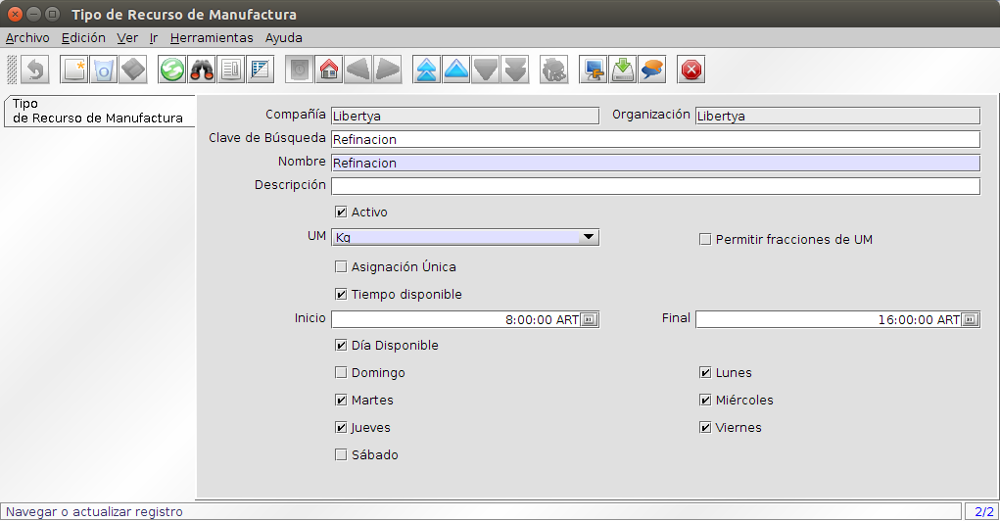
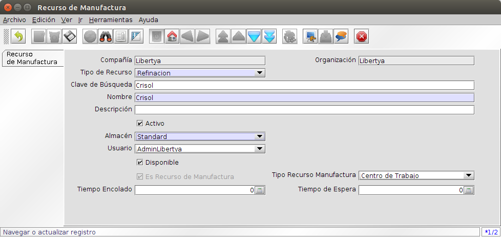
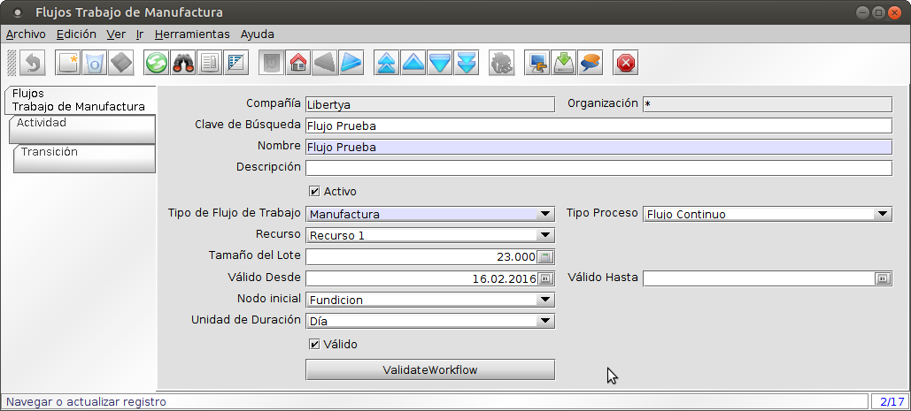
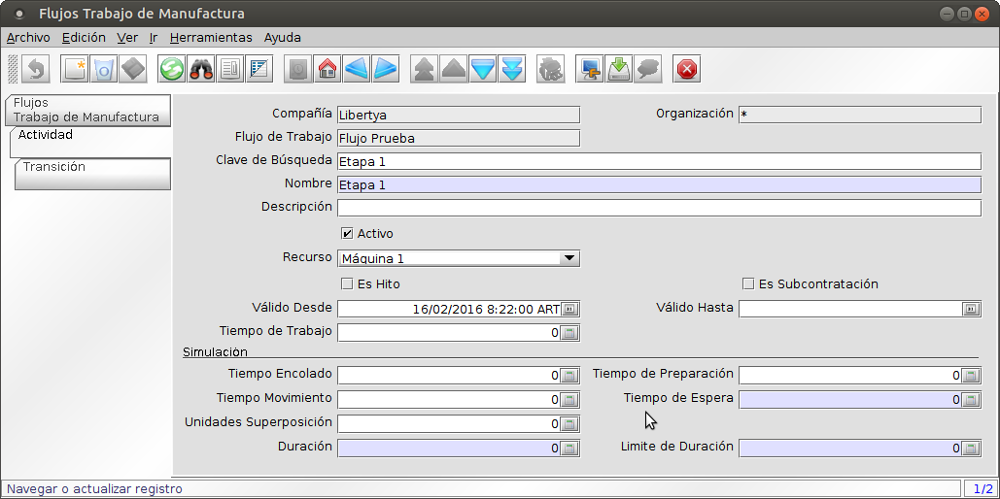

Manufactura - Flujos de Trabajo
*******************************

Los Flujos de Trabajo de Manufactura, definen la estructura de **Etapas productivas** y **Recursos** asociados a cada etapa.

Tipos de Recursos de Manufactura
--------------------------------

Los **Tipo de Recurso de Manufactura** proveen un agrupamiento mediante una relación jerárquica: por ejemplo un **Centro de Trabajo** se puede integrar en una **Estación de Trabajo**, una **Línea de Producción**, que a su vez junto a otras líneas se integran en una **Planta**. Esta agrupación de tipos de recursos, se utilizará para calcular la capacidad requerida y disponible de producción mediante la sumatoria individual de las capacidades de cada recurso.

Un primer nivel de agrupamiento será utilizado para definir una tipología de recursos que tengan en común una serie de características.

1. Acceder a la opción del menú **Gestión de Ingeniería →  Recursos de Manufactura → Tipo de Recurso de Manufactura**. El sistema presenta una ventana como lo muestra la Imagen Ing001.
2. Campos a ingresar:
	* **Compañía:** Cliente para esta instalación Compañía o entidad legal 
	* **Organización:** Entidad organizacional dentro de la compañía.
	* **Clave de Búsqueda** Clave de búsqueda para el registro en el formato requerido; debe ser única.
	* **Nombre:** Identificador alfanumérico de la entidad. El nombre de una entidad (registro) se usa como una opción de búsqueda predeterminada adicional a la clave de búsqueda. El nombre es de hasta 60 caracteres de longitud. 
	* **Descripción:** Descripción corta opcional del registro Una descripción esta limitada a 255 caracteres.
	* **Activo:** El registro está activo en el sistema Hay dos métodos para que los registros no estén disponibles en el sistema: Uno es eliminar el registro; el otro es desactivarlo. Un registro desactivado no está disponible para selección; pero está disponible para Informes. 
	* **UM:** Unidad de Medida La UM define una unidad de medida única (días, horas, kilos, litros).
	* **Permitir fracciones de UM:** Permitir fracciones de unidad de medida Si se habilita; se puede entrar fracciones de la unidad de medida. 
	* **Asignación Única solamente:** Solamente una asignación a la vez (No se puede tener asignaciones dobles de tiempo o asignaciones concurrentes) Si se selecciona; solo se puede tener una asignación a la vez para un momento en el tiempo. No es posible tener asignaciones concurrentes.
	* **Tiempo Disponible:** Indica si el recurso está disponible sólo en algún momento, habilita los campos Inicio y Final.
	* **Inicio:** Momento cuando el tiempo disponible comienza.
	* **Final:** Momento cuando el tiempo disponible finaliza.
	* **Día Disponible:** Indica si el recurso está disponible sólo algunos días de la semana, habilita los campos para cada uno de los días (lunes, martes, miércoles, jueves, viernes, sábado y domingo).
3. Guardar.

Imagen Ing001: Tipo de Recurso de Manufactura

Recurso de manufactura
----------------------

Ahora podemos definir todos los Recursos de Manufactura, clasificados mediante los Tipos de Recursos, para poder utilizarlos luego en el Flujo de Trabajo.

Un **Recurso de Manufactura** es cualquier cosa requerida como soporte para el proceso de producción. Principalmente responde a la pregunta: ¿En dónde se hace un producto?. Cada recurso de trabajo es único dentro de la organización y puedo definir tantos recursos como sea necesario.

1. Acceder a la opción del menú **Gestión de Ingeniería →  Recursos de Manufactura → Recurso de Manufactura**. El sistema presenta una ventana como lo muestra la Imagen Ing002.
2. Campos a ingresar:
	* **Compañía:** Cliente para esta instalación Compañía o entidad legal 
	* **Organización:** Entidad organizacional dentro de la compañía.
	* **Tipo de Recurso: ** Es el Tipo de Recurso de Manufactura registrado en el paso anterior.	
	* **Clave de Búsqueda** Clave de búsqueda para el registro en el formato requerido; debe ser única.
	* **Nombre:** Identificador alfanumérico de la entidad. El nombre de una entidad (registro) se usa como una opción de búsqueda predeterminada adicional a la clave de búsqueda. El nombre es de hasta 60 caracteres de longitud. 
	* **Descripción:** Descripción corta opcional del registro Una descripción esta limitada a 255 caracteres.
	* **Activo:** El registro está activo en el sistema Hay dos métodos para que los registros no estén disponibles en el sistema: Uno es eliminar el registro; el otro es desactivarlo. Un registro desactivado no está disponible para selección; pero está disponible para Informes. 
	* **Almacén:** El Almacén indica un Almacén único donde los productos son almacenados.  
	* **Usuario:** Indica un usuario de referencia o contacto.
	* **Disponible:** Indica si el recurso está disponible.
	* **Es Recurso Manufactura:** Indica si el recurso es requerido para la producción. Este campo debe estar seleccionado.
	* **Tipo de Recurso Manufactura:** Es el Tipo de Recurso Manufactura General, al menos uno de los Recursos debe ser del tipo **Planta** y deberá configurarse en el Flujo de Trabajo de Manufactura. 
	* **Tiempo Encolado:** Es una referencia donde se ingresa el tiempo total de encolado del recurso.
	* **Tiempo de espera:** El tiempo de preparación es el requerido para ejecutar las actividades necesarias para preparar el recurso de manufactura hasta que esté listo para comenzar con el proceso de fabricación.
3. Guardar.

Imagen Ing002: Recurso de Manufactura

Flujo de Trabajo
----------------

Permite definir el flujo de etapas de producción para la elaboración de un producto.

Flujo de Trabajo - Cabecera
---------------------------

1. Acceder a la opción del menú **Gestión de Ingeniería →  Flujos de Trabajo de Manufactura → Flujos de Trabajo de Manufactura**. El sistema presenta una ventana como lo muestra la Imagen Ing003.
2. Campos a ingresar:
	* **Compañía:** Cliente para esta instalación Compañía o entidad legal 
	* **Organización:** Entidad organizacional dentro de la compañía.
	* **Descripción:** Descripción corta opcional del registro Una descripción esta limitada a 255 caracteres.
	* **Activo:** El registro está activo en el sistema Hay dos métodos para que los registros no estén disponibles en el sistema: Uno es eliminar el registro; el otro es desactivarlo. Un registro desactivado no está disponible para selección; pero está disponible para Informes. 
	* **Tipo de Flujo de Trabajo:** Indica la naturaleza del uso del flujo, esto debido a que el sistema usa la misma estructura para administrar diferentes tipos de flujos de trabajo, por ejemplo para los estados de documentos. En lo que refiere al componente debe estar indicado como Manufactura.  
	* **Tipo de Proceso:** Indica la naturaleza del flujo.
		* Flujo continuo: el flujo continuo generalmente se refiere a la producción o procesamiento de artículos a granel: fluidos, desechos, polvos, metales básicos y otros.
		* Flujo repetitivo dedicado: las partes discretas tales como ejes y bielas y conjuntos discretos tales como microcomputadoras pueden producirse mediante un proceso de flujo repetitivo. El término dedicado implica que la instalación de producción produce solo un producto, incluidas las variaciones del producto (como el color) que no requieren un retraso en la instalación del proceso de fabricación.
		* Flujo de lotes: Funcionalmente es el mismo que el continuo o el repetitivo, excepto que dos o más productos se fabrican en la misma instalación. Debido a los largos tiempos de configuración en el taller de flujo de lotes, las ejecuciones de fabricación para cada producto suelen durar varias horas o varios días.
		* Modelo mixto de flujo repetitivo: también se utiliza para fabricar dos o más modelos. Sin embargo, el tiempo de cambio entre modelos es mínimo, y los diferentes modelos se entremezclan en la misma línea.
	* **Recurso:** Es una referencia del recurso de tipo **Planta** definido para la fabricación.
	* **Tamaño de Lote:** Determina la cantidad del lote de producción para el producto.
	* **Válido Desde:** Inicio del período de validez del registro.
	* **Válido Hasta:** Fin del período de validez del registro.
	* **Nodo Inicial:** Nodo de inicio del flujo.
	* **Unidad de Duración:** Unidad de medida de duración de las actividades.
	* **Válido:** Check que indica si el flujo es correcto en su estructura (por ejemplo no posee ciclos).
	* **Validar:** Acción que chequea la validez del flujo y modifica el check Válido.
3. Guardar.

Imagen Ing003: Flujo de Trabajo de Manufactura

Flujo de Trabajo - Líneas
-------------------------

1. Acceder a la opción del menú **Gestión de Ingeniería →  Flujos de Trabajo de Manufactura → Flujos de Trabajo de Manufactura**. El sistema presenta una ventana como lo muestra la Imagen Ing003. Acceder a la pestaña **Actividad** el sistema presenta una ventana como muestra la Imagen Ing004.
2. Campos a ingresar:
	* **Compañía:** Cliente para esta instalación Compañía o entidad legal 
	* **Organización:** Entidad organizacional dentro de la compañía.
	* **Clave de Búsqueda:** Código identificador alfanumérico de la entidad. 
	* **Nombre:** Identificador alfanumérico de la entidad. El nombre de una entidad (registro) se usa como una opción de búsqueda predeterminada adicional a la clave de búsqueda. El nombre es de hasta 60 caracteres de longitud. 
	* **Descripción:** Descripción corta opcional del registro Una descripción esta limitada a 255 caracteres.
	* **Activo:** El registro está activo en el sistema Hay dos métodos para que los registros no estén disponibles en el sistema: Uno es eliminar el registro; el otro es desactivarlo. Un registro desactivado no está disponible para selección; pero está disponible para Informes. 
	* **Recurso:** es una referencia del recurso de fabricación donde se realizará el trabajo (recurso atómico tipo maquinaria, por ejemplo envasadora).
	* **Es Hito:** Indica si la actividad es hito en el proceso.
	* **Es Subcontratación:** Indica si la actividad es subcontratada a un proveedor.
	* **Entidad Comercial:** Indica el proveedor al que se le subcontrata la actividad.  
	* **Válido Desde:** Inicio del período de validez del registro.
	* **Válido Hasta:** Fin del período de validez del registro.
	* **Tiempo de Trabajo:** Determina el tiempo por Unidad de Duración (campo de la cabecera) para la fabricación de una unidad de producto o un lote de producto en caso de estar configurado.
	* **Tiempo de Encolado:** Determina el tiempo por Unidad de Duración (campo de la cabecera) para la etapa de Encolado en la fabricación de una unidad de producto o un lote de producto en caso de estar configurado.
	* **Tiempo de Preparación:** Determina el tiempo por Unidad de Duración (campo de la cabecera) para la etapa de Preparación en la fabricación de una unidad de producto o un lote de producto en caso de estar configurado.
	* **Tiempo de Movimiento:** Determina el tiempo por Unidad de Duración (campo de la cabecera) para la etapa de Movimiento en la fabricación de una unidad de producto o un lote de producto en caso de estar configurado.
	* **Tiempo de Espera:** Determina el tiempo por Unidad de Duración (campo de la cabecera) para la etapa de Espera en la fabricación de una unidad de producto o un lote de producto en caso de estar configurado.
	* **Unidades de Superposición:** Es la cantidad mínima de productos que necesita para terminar en el nodo actual antes de poder continuar con el siguiente nodo.
	* **Unidades por Ciclo:** Si se tiene un flujo repetitivo, este campo representa la cantidad de productos que se pueden producir en la unidad de medida de tiempo a partir del recurso de fabricación. Esta información se usa en lugar del campo Duración.
	* **Duración:** Determina el tiempo requerido para ejecutar una operación para un producto.	
	* **Límite de Duración:** Determina el tiempo máximo que puede excederse a la duración estimada.
3. Guardar.

Imagen Ing004: Flujo de Trabajo de Manufactura - Actividades
		