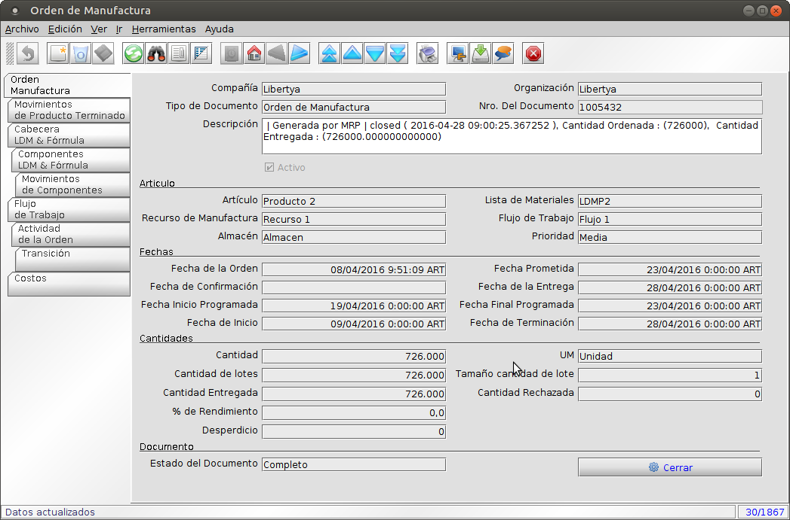
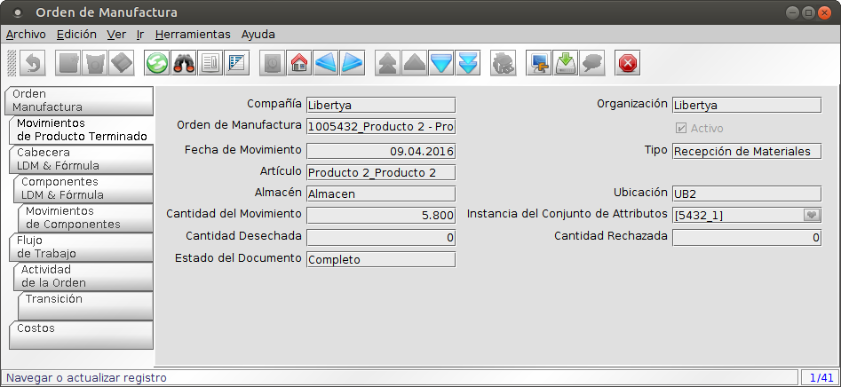
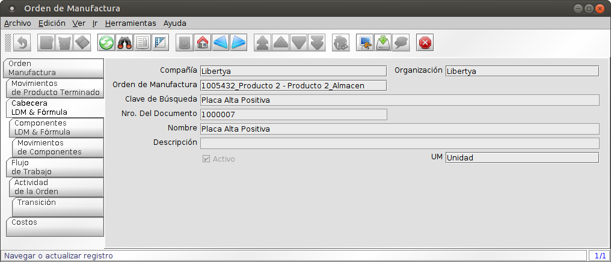
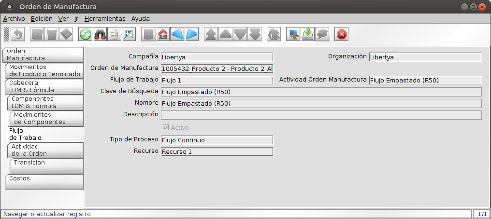
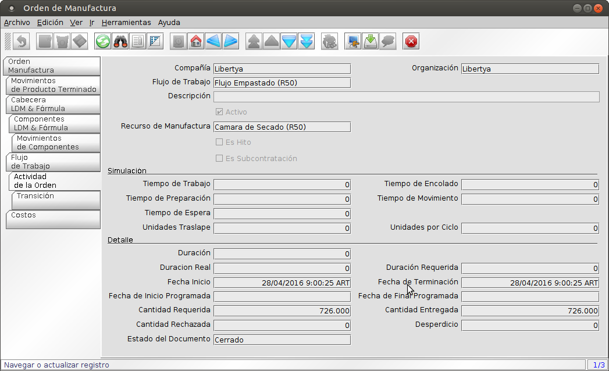

Una **Orden de Manufactura** (orden de producción) es un documento que indica a la planta el compromiso de fabricar un producto en una cantidad establecida y en una fecha específica.

La ordenes de manufactura pueden ser cradas de forma manual o de forma automática durante a ejecsión del proceos del MRP.

1. Acceder a la opción del menú **Gestión de Manufactura →  Gestión de la Producción → Orden de Manufactura**. El sistema presenta una ventana como lo muestra la Imagen Oper001.
2. Campos a ingresar:
	* **Compañía:** Compañía o empresa que utiliza ésta instalación. Compañía, empresa o entidad legal. No se puede compartir datos entre compañías.
	* **Organización:** Entidad organizacional dentro de la compañía. Una organización es una unidad de la compañía o entidad legal - Ej. Tiendas y departamentos.
	* **Tipo Documento Destino:** Debe ser Orden de Manufactura.
	* **Nro. Del Documento:** Número identificador de la Orden de Manufactura. Es generado automáticamente por el sistema y determinado por el tipo del documento.
	* **Descripción:** Descripción corta opcional del registro. Una descripción esta limitada a 255 caracteres.
	* **Activo:** El registro está activo en el sistema. Hay dos métodos para que los registros no estén disponibles en el sistema: Uno es eliminar el registro; el otro es desactivarlo. Un registro desactivado no está disponible para selección; pero está disponible para reportes.
	* **Artículo:** Artículo objeto de la producción asociada a esta Orden de Manufactura.
	* **Lista de Materiales:** Lista de Materiales asociada al artículo objeto de la producción asociada a esta Orden de Manufactura.
	* **Recurso de Manufactura:** Planta donde se realiza la producción.
	* **Flujo de Trabajo:** Flujo de trabajo o combinación de tareas, asociado al artículo objeto de la producción asociada a esta Orden de Manufactura.
	* **Almacén:** Almacén asociado al artículo objeto de la producción asociada a esta Orden de Manufactura.
	* **Prioridad:** Prioridad de un documento. La prioridad indica la importancia (alta; media; baja) de este documento.
	* **Fecha de la Orden:** Indica la fecha de creación de la orden.
	* **Fecha Prometida:** Indica la fecha en la que se espera la Orden de Manufactura este finalizada.
	* **Fecha de Confirmación**
	* **Fecha de la Entrega**
	* **Fecha Inicio programada:** Fecha Inicio Programada para la OM.
	* **Fecha Final Programada:** Fecha Final Programada para la OM.
	* **Fecha de Inicio:** Es la fecha cuando el primer movimiento de la orden de manufactura fue reportado, este movimiento puede ser un inventario o movimiento de labor.
	* **Fecha de Terminación:** La fecha final se usa para indicar cuando se espera que el proyecto se complete o cuando ha sido completado.
	* **Cantidad:** Cantidad de la Orden de Manufactura.
	* **UM:** Unidad de Medida del Producto de la Orden de Manufactura.
	* **Cantidad de Lotes**
	* **Tamaño Cantidad Lote**
	* **Cantidad Entregada:** La Cantidad Entregada indica la cantidad de un producto que ha sido entregada.
	* **Cantidad Rechazada:** La Cantidad Rechazada indica la cantidad de un producto que ha sido rechazada.
	* **% de Rendimiento**
	* **Desperdicio:** Indica el desperdicio de producto terminado por problemas productivos.
	* **Estado del Documento:** El Estado del Documento indica el estado del documento en este momento. Si usted quiere cambiar el Estado del Documento; use el campo Acción del Documento.
	* **Acción en el Documento:** El estado destino del documento .

3. Guardar

Imagen Oper001: Orden de Manufactura

La ventana de Orden de Manufactura nuclea información de la gestión de una orden:

* **Orden de Manufactura:** Tiene la información general de la orden.
* **Movimientos de Producto Terminado:** Información de los movimientos vinculados al producto a fabricar (recepciones de producto terminado).

Imagen Oper002: Movimientos de Producto Terminado

* Copia (instancia) de la fórmula del producto definida en el planeamiento.

	* **Cabecera LDM & Fórmula:** Pestaña informativa de cabecera de la fórmula.

	

	Imagen Oper003: Cabecera LDM & Fórmula

	* **Componentes LDM & Fórmula:** Pestaña de los componentes de la fórmula, con las cantidades correspondientes a la cantidad de producto terminado a fabricar en la orden. Esta pestaña registra las cantidades totales entregadas por componentes y los pendientes de entrega,	 entre otros datos.

	
	

	Imagen Oper004: Componentes LDM & Fórmula

	* **Movimiento de Componentes:** Información de los movimientos vinculados a componentes de la fórmula (entregas y devoluciones).

	

	Imagen Oper005: Componentes LDM & Fórmula

* Copia (instancia) del flujo de trabajo del producto definido en el planeamiento.

	* **Flujo de Trabajo:** Pestaña informativa de cabecera del flujo de trabajo.

	

	Imagen Oper006: Flujo de Trabajo

	* **Actividad de la Orden:** Pestaña de las actividades o etapas del flujo de trabajo para la orden. Registra los tiempos y cantidades asociados a los registros de actividades realizados para la orden.

	
	

	Imagen Oper007: Componentes LDM & Fórmula

* **Costos.**