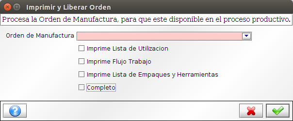
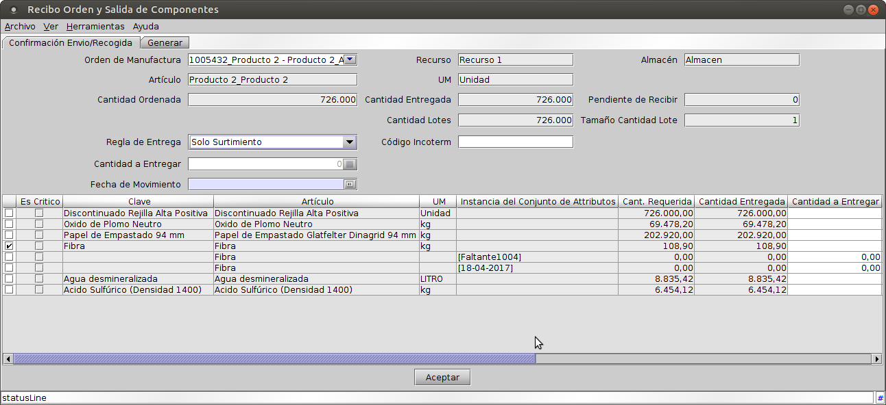
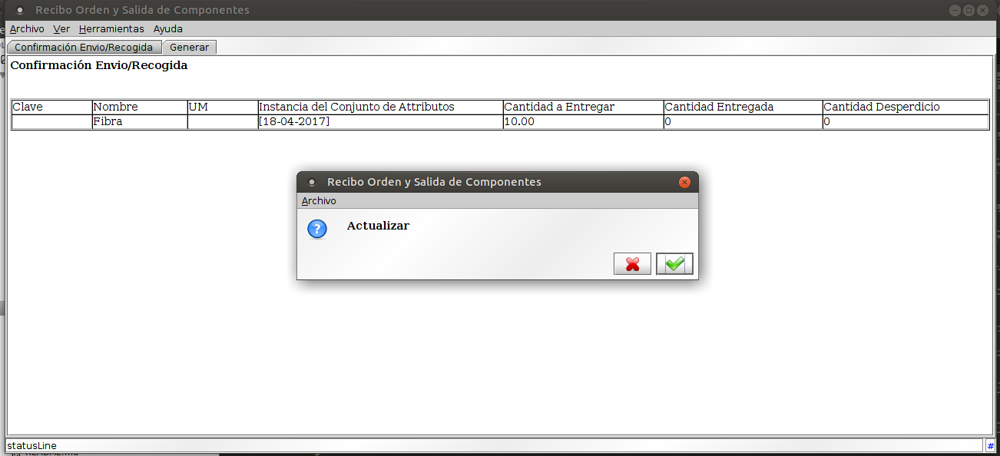
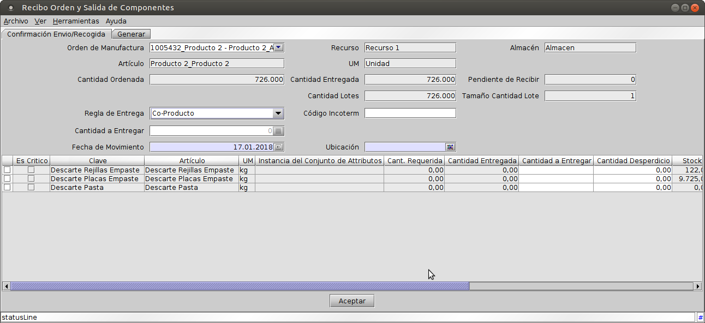

Las operaciones básicas con las Ordenes de Manufactura son las siguientes:

1. **Imprimir y Liberar Orden:** procesa la Orden de Manufactura y si existe stock disponible para los componentes críticos, genera la reserva de stock de los componentes de la fórmula y para a Completo el documento permitiendo operaciones de surtimiento y devoluciones de materiales, recepción de productos terminados y cierre de la orden.
2. **Entrega de Materiales para Producción:** permite hacer el surtimiento de materiales para la Orden de Manufactura.
3. **Devolución de Materiales de Producción:** permite hacer la devolución de los materiales sobrantes en el proceso de la Orden de Manufactura.
4. **Recepción de Producto Terminado:** permite registrar el rendimiento final de la Orden de Manufactura.
5. **Cierre de la Orden de Manufactura:** permite liberar los materiales reservados, que ya no van a utilizarse y realizar los cálculos de costos asociados a la Orden de Manufactura, finalizando así las transacciones.

**Imprimir y Liberar Orden**
****************************

1. Acceder a la opción del menú **Gestión de Manufactura →  Gestión de la Producción → Imprimir y Liberar Orden**. El sistema presenta una ventana como lo muestra la Imagen Oper009.
2. Campos a ingresar:
	* **Orden de Manufactura:** Documento a procesar.
	* **Imprime Lista de Utilización:** Imprime el documento asociado.
	* **Imprime Flujo de Trabajo:** Imprime el documento asociado.
	* **Imprime Lista de Empaque y Herramientas:** Imprime el documento asociado.
	* **Completar:** Procesa el documento, caso contrario funciona como prueba.

Finalizado el proceso puede verificarse la reserva de materiales en los componentes de la fórmula explotada en la ventana de la Orden de Manufactura.

Imagen Oper009: Imprimir y Liberar Orden

**Entrega de Materiales para Producción**
*****************************************

Permite realizar el surtimiento de materiales afectados a la producción. Detalla el stock disponible en el almacén de la Orden de Manufactura, posibilitando seleccionar los lotes específicos o generales desde los que se va a hacer la entrega, dependiendo si el producto tiene o no control de lotes asociado.

1. Acceder a la opción del menú **Gestión de Manufactura →  Gestión de la Producción → Recibo Orden y Salida de Componentes**.
2. Seleccionar la **Orden de Manufactura**.
3. El sistema presenta información de los siguientes datos:
	* **Recurso**.
	* **Almacén**.
	* **Artículo**.
	* **UM**.
	* **Cantidad Ordenada**.
	* **Cantidad Entregada**.
	* **Pendiente de Recibir**.
	* **Cantidad de Lotes**.
	* **Tamaño Cantidad de Lote**.
4. Seleccionar la **Regla de Entrega → Solo Entrega**, El sistema presenta una ventana como lo muestra la Imagen Oper010. Campos a ingresar:
	* **Fecha del Movimiento**:.
	* **Selección de Productos y/o Lotes:** Seleccionando el check disponible en la primera columna, determinamos desde que productos y/o que lotes de cada producto (para productos que tengan conjunto de atributos) entregar para producción.
	* **Cantidad a Entregar**: Determinar que cantidad se va a entregar.
	* **Cantidad Desperdicio**: Determinar que cantidad se desperdicia en el proceso.
5. Confirmar la operación con **Aceptar**.
6. Confirmar resumen de operación en la ventana como la que muestra la Imagen Oper011.

Imagen Oper010: Entrega de Materiales para Producción

Imagen Oper011: Confirmar Operación de Entrega o Recibo.

**Devolución de Materiales de Producción**
******************************************

Permite realizar la devolución de materiales afectados a la producción. Detalla el stock disponible en el almacén de la Orden de Manufactura, posibilitando seleccionar los lotes específicos o generales desde los que se va a hacer la devolución, dependiendo si el producto tiene o no control de lotes asociado.

La estructura de la interfqaz es similar a la presentada para Surtimientos.

1. Acceder a la opción del menú **Gestión de Manufactura → Gestión de la Producción → Recibo Orden y Salida de Componentes**.
2. Seleccionar la **Orden de Manufactura**.
3. El sistema presenta información de los siguientes datos:
	* **Recurso**.
	* **Almacén**.
	* **Artículo**.
	* **UM**.
	* **Cantidad Ordenada**.
	* **Cantidad Entregada**.
	* **Pendiente de Recibir**.
	* **Cantidad de Lotes**.
	* **Tamaño Cantidad de Lote**.
4. Seleccionar la **Regla de Entrega → Reducción de Surtimiento**. Campos a ingresar:
	* **Fecha del Movimiento**:.
	* **Selección de Productos y/o Lotes:** Seleccionando el check disponible en la primera columna, determinamos desde que productos y/o que lotes de cada producto (para productos que tengan conjunto de atributos) hacer la devolución.
	* **Cantidad a Entregar**: Determinar que cantidad se va a devolver.
	* **Cantidad Desperdicio**: Determinar que cantidad se desperdicia en el proceso.
5. Confirmar la operación con **Aceptar**.
6. Confirmar resumen de operación.

**Recepción de Producto Terminado**
***********************************

Permite realizar el ingreso de materiales de la orden como resultado de la producción.

1. Acceder a la opción del menú **Gestión de Manufactura → Gestión de la Producción → Recibo Orden y Salida de Componentes**.
2. Seleccionar la **Orden de Manufactura**.
3. El sistema presenta información de los siguientes datos:
	* **Recurso**.
	* **Almacén**.
	* **Artículo**.
	* **UM**.
	* **Cantidad Ordenada**.
	* **Cantidad Entregada**.
	* **Pendiente de Recibir**.
	* **Cantidad de Lotes**.
	* **Tamaño Cantidad de Lote**.
4. Seleccionar la **Regla de Entrega → Solo Recepción**. El sistema presenta una ventana como lo muestra la Imagen Oper012. Campos a ingresar:
		* **Fecha del Movimiento**:.
		* **Instancia de Conjunto de Atributos:** Permite seleccionar a que lote corresponde el recibo de la Orden de Manufactura.
		* **Ubicación**: Determinar en que ubicación ingresa el stock resultante.
		* **Cantidad a Entregar**: Cantidad de la Entrega.
		* **Cantidad Desperdicio**: Cantidad desperdiciada si la hubiera.
		* **Cantidad Rechazada**: Cantidad rechazada si la hubiera.
5. Confirmar la operación con **Aceptar**.
6. Confirmar resumen de operación.

Imagen Oper012: Operación de Recepción de Producto Terminado.

**Recepción de Co-Producto**
****************************

Los Co-Productos son productos derivados de una fabricación. Dichos productos pueden ser ingresados al stock a partir de esta operación.

1. Acceder a la opción del menú **Gestión de Manufactura → Gestión de la Producción → Recibo Orden y Salida de Componentes**.
2. Seleccionar la **Orden de Manufactura**.
3. El sistema presenta información de los siguientes datos:
	* **Recurso**.
	* **Almacén**.
	* **Artículo**.
	* **UM**.
	* **Cantidad Ordenada**.
	* **Cantidad Entregada**.
	* **Pendiente de Recibir**.
	* **Cantidad de Lotes**.
	* **Tamaño Cantidad de Lote**.
4. Seleccionar la **Regla de Entrega → Co-Producto**. El sistema presenta una ventana como lo muestra la Imagen Oper013. Campos a ingresar:
	* **Fecha del Movimiento**:.
	* **Selección de Productos:** Seleccionando el check disponible en la primera columna, determinamos que Co-Productos van a registrar recepción.
	* **Cantidad a Entregar**: Determinar que cantidad se va a recibir.
5. Confirmar la operación con **Aceptar**.
6. Confirmar resumen de operación.

Imagen Oper013: Operación de Recepción de Co-Producto.

**Cierre de la Orden de Manufactura**
*************************************

El cierre de la Orden de Manufactura, completa el circuito de operación de la misma. Libera el reservado de los componentes de la fórmula y realiza el cálculo de los costos.

1. Acceder a la opción del menú **Gestión de Manufactura →  Gestión de la Producción → Orden de Manufactura**..
2. Buscar la Orden de Manufactura.
3. Cerrar la Orden de Manufactura con el botón **Cerrar**.

**Cancelación de la Orden de Manufactura**
******************************************

En caso que sea necesaria la cancelación del proceso productivo, se dispone de una opción que vuelve atrás el procesamiento actual de la orden.

1. Acceder a la opción del menú **Gestión de Manufactura →  Gestión de la Producción → Orden de Manufactura**.
2. Buscar la Orden de Manufactura.
3. Cerrar la Orden de Manufactura con el botón **Cancelar**.