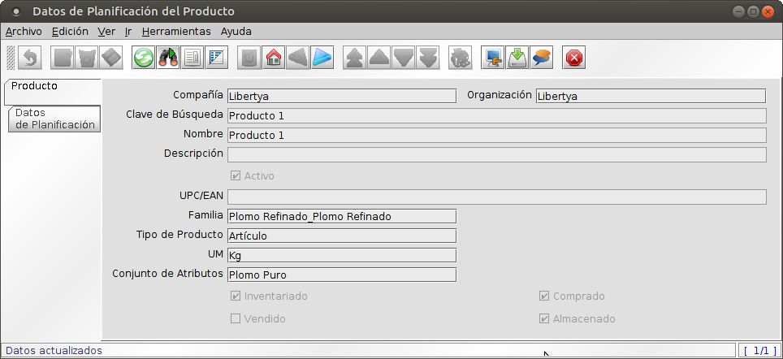

Manufactura - Datos de Planificación de producto
************************************************
 
Para calcular el Plan de Materiales, primero debemos configurar los **Datos de Planeamiento de los Productos** que intervienen en el proceso productivo.

Los Datos de Planeamiento de los Productos varían según los productos sean comprados o fabricados. Para los primeros se deben configurar los datos relacionados a tiempos y políticas de compra, mientras que para los segundos, los datos y políticas de fabricación, entre ellos la **Lista de Materiales** y el **Flujo de Trabajo**.

1. Acceder a la opción del menú **Gestión de Manufactura →  Gestión de Planificación → Datos de Planificación de Productos**. El sistema presenta una ventana como lo muestra la Imagen Plan001. Buscar el producto a configurar en la primera pestaña.
2. Acceder a la pestaña **Línea de Movimiento**, el sistema presenta una ventana como lo muestra la Imagen Plan002.
3. Campos a ingresar:
	* **Compañía:** Cliente para esta instalación compañía o entidad legal 
	* **Organización:** Entidad organizacional dentro de la compañía. Una organización es una unidad de la compañía o entidad legal.
	* **Activo:** El registro está activo en el sistema Hay dos métodos para que los registros no estén disponibles en el sistema: Uno es eliminar el registro; el otro es desactivarlo. Un registro desactivado no está disponible para selección; pero está disponible para Informes.
	* **Recurso:** Recurso de tipo Planta para esta configuración de Datos de Planeamiento.
	* **Almacén:** Almacén para esta configuración de Datos de Planeamiento.
	* **Planificador:** Usuario responsable de la planificación.
	* **Lista de Materiales:** En caso de productos fabricados, la Lista de Materiales correspondiente.
	* **Flujo de Trabajo:** En caso de productos fabricados, el Flujo de Trabajo correspondiente.
	* **Es Plan Maestro de Producción:** Indica si el producto puede satisfacer una demanda de plan de producción.
	* **Crear Plan:** Si queremos que en la configuración de Datos de Planeamiento entre en consideración del MRP.
	* **Es MRP Requerido:** Lo pone el sistema de forma automática, si algún cambio en las configuraciones, requiere correr nuevamente el MRP.
	* **Tiempos de Gestión:** 
		* **Tiempo de Entrega Prometido:** Contempla el tiempo de entrega desde que la cantidad promedio de días para recibir el producto en el almacén, desde que se aprueba la solicitud de compra o la orden de fabricación.
		* **Tiempo de Transferencia:** es el número de días que el producto debe ser movido de un almacén a otro para estar disponible en el proceso productivo. 
	* **Política de Ordenamiento:** La política de ordenamiento se refiere a la forma en que el MRP debe ajustar las órdenes planeadas a las necesidades de la organización. La política Cantidad Orden Período se refiere a la forma en que el MRP puede crear una orden planeada simple para cada requerimiento neto para un cierto número de dias. Esos días se registran en el el campo Período de Pedido.La politica Lote por lote, cuando el proceso MRP debe generar una orden planeada para cada demanda no satisfecha.
	* **Periodo de Pedido:** Para la política Cantidad Orden Período, determina el plazo de agrupamiento.	
	* **Múltiplo a Ordenar:** La Cantidad del Paquete a Ordenar indica el número de unidades en cada paquete de este producto.
	* **Cantidad Mínima de Pedido:** La Cantidad Mínima de Pedido se utiliza cuando las ordenes deben ser generadas al menos para esa cantidad, debido a políticas del proveedor o límites de fabricación.El Proceso MRP utilizará esta cantidad cuando calcule la orden planeada para una cantidad menor que la Cantidad Mínima de Pedido. El sistema generará un aviso para advertir sobre este cambio en la cantidad.
	* **Cantidad Máxima del Pedido:** Es la máxima cantidad de la orden y se utiliza cuando las órdenes deberían ser generada para esta cantidad máxima debido a políticas del proveedor o limitaciones del almacén. El Proceso MRP utilizará la cantidad calculada para crear la orden planeada pero generará un Aviso de advertenciaque la cantidad es mayor que la Cantidad Máxima del Pedido.
	* **% Rendimiento:** Se refiere al porcentaje de productos no defectuosos sobre el total de los productos fabricados o comprados.
	* **Cantidad Existencia Seguridad:** Se utiliza para establecer el nivel extra de stock que se mantiene en almacén para hacer frente a eventuales faltantes de stock generados o por retraso del proveedor, o por evolución no prevista de la demanda. La existencia de seguridad es definida como unidades extra de inventario mantenidas como protección contra posible escasez. Es mantenida cuando una organización no puede predecir en forma precisa la demanda o el tiempo de entrega para el producto.
	* **Es alternativo:** Marcar esta casilla de verificación si este producto es utilizado en una LdM y puede ser reemplazado por otro componente alternativo. Los productos alternativos a este componente, deberán ser incluidos en la misma LdM como componente fantasma.En el momento de correr el proceso MRP la política de ordenamiento de este producto será Lote a Lote y no se reservarán cantidades.
4. Guardar.

Imagen Plan001: Planeamiento

Imagen Plan002: Planeamiento - Datos de Planeamiento

