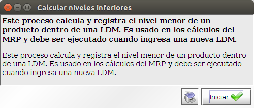
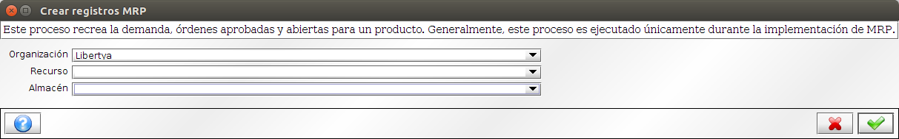
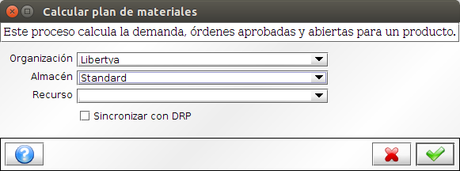

**Manufactura - Processo MRP**
******************************

Imagen Oper015: Proceso MRP

**Manufactura - Ejecución del MRP**
***********************************

La ejecución del Proceso de MRP debe completarse siguiendo los paso detallados a continuación:

**Paso 1: Calcular Niveles Inferiores**
***************************************

Este proceso calcula y registra el nivel menor de un producto dentro de una LDM. Es usado en los cálculos del MRP y debe ser ejecutado cuando ingresa una nueva LDM.

1. Acceder a la opción de menú **Gestión de Manufactura → Gestión de Planificación → MRP → Calcular Niveles Inferiores**. El sistema presenta una ventana como lo muestra la Imagen Oper016.
2. Ejecutar Proceso.

Imagen Oper016: Calcular Niveles Inferiores

**Paso 2: Crear Registros MRP**
*******************************

Este proceso recrea la demanda, órdenes aprobadas y abiertas para un producto. 

1. Acceder a la opción de menú **Gestión de Manufactura → Gestión de Planificación → MRP → Crear Registros MRP**. El sistema presenta una ventana como lo muestra la Imagen Oper017.
2. Ejecutar Proceso.

Imagen Oper017: Crear Registros MRP

**Paso 3: Calcular Plan de Materiales**
***************************************

Cumplidos los pasos anteriores, podemos calcular el plan de materiales.

Durante este proceso se establece si las existencias y las requisiciones existentes satisfacen las necesidades para la producción. Este proceso calcula la demanda, órdenes aprobadas y abiertas para un producto.

Cuando este proceso finaliza, se muestra un resumen de las Órdenes de Manufactura, los Avisos de Pedido a Proveedores y los Avisos del MRP que fueron generados.

1. Acceder a la opción de menú **Gestión de Manufactura → Gestión de Planificación → MRP → Calcular Plan de Materiales**. El sistema presenta una ventana como lo muestra la Imagen Oper018.
2. Ejecutar Proceso.

Imagen Oper018: Calcular Plan de Materiales

**Avisos del MRP**
******************

Contiene un grupo de mensajes generados por el proceso MRP. Indica al usuario que acciones son necesarias, para poder alcanzar el Planeamiento de Producción correctamente.

1. Acceder al botón **Aviso** de la pantalla principal de la aplicación (barra inferior a la izquierda). El sistema presenta una ventana como lo muestra la Imagen Oper019.

Imagen Oper019: Avisos

**Referencias de Avisos**

* MRP-001: El mensaje se genera cuando la cantidad existente de un producto, se encuentra por debajo de los márgenes mínimos seguros (cantidad mínima).

* MRP-020: El mensaje se genera cuando la existencia de un producto queda en valores negativos y debería crearse un pedido a proveedor para satisfacer una demanda. Este mensaje es creado si el campo "Crear Plan" está desactivado.
Vea la ventana Datos de planificación.

* MRP-030: El mensaje se genera cuando un pedido a proveedor puede llegar a ser procesado antes de ser necesitado. Se aconseja que el pedido se retrase o se reprograme a un estado anterior.

* MRP-040: El mensaje se genera cuando una orden de manufactura será entregada con mucha posterioridad a ser necesaria y debería ser reprogramada a una fecha anterior o bien reprocesarla.

* MRP-050: El mensaje se genera cuando un pedido a proveedor ya no es necesario y debería ser borrado.

* MRP-060: El mensaje se genera cuando un pedido a proveedor se encuentra en estado borrador y debería completarse para ser aprobado.

* MRP-070: El mensaje se genera cuando una orden de manufactura no fue lanzada en el momento debido, y debe ser lanzado ahora, o bien reprogramar la orden para una fecha posterior.

* MRP-080: El mensaje se genera cuando un pedido a proveedor solicita una cantidad de un producto que es menor a la cantidad prevista en la planificación de stock. 
Vea Artículos -> Datos de planificación.

* MRP-090: El mensaje se genera cuando un pedido a proveedor solicita una cantidad de un producto que es mayor a la cantidad prevista en la planificación de stock. 
Vea Artículos -> Datos de planificación.

* MRP-100: El mensaje se genera cuando existe un requerimiento de material insatisfecho dentro del tiempo de protección planeado para este artículo. Para solucionarlo debería programarlo manualmente, acelerar órdenes para llenar la demanda o bien retrasar la satisfacción del requerimiento que creó la demanda.

* MRP-110: El mensaje se genera cuando un pedido a proveedor está vencido.

* MRP-120: El mensaje se genera cuando existe un producto que no tiene planeación ya sea de compra o manufactura.

* MRP-130: El mensaje se genera cuando un producto no tiene proveedor asignado.

* MRP-140: El mensaje se genera cuando el stock de un producto es negativo.

* MRP-150: El mensaje se genera cuando existe una orden de manufactura vencida.

* MRP-160: El mensaje se genera cuando se produce un error durante la creación de un documento.

* MRP-999: El mensaje se genera cuando ocurre un error inesperado en el proceso MRP.
