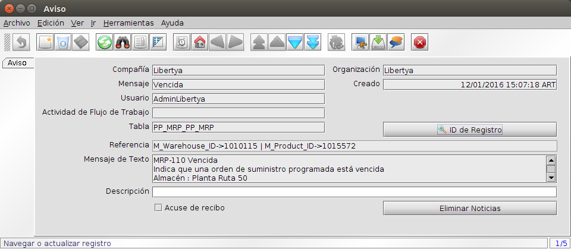

**Manufactura - Processo MRP**
******************************

Imagen Oper015: Proceso MRP

**Manufactura - Ejecución del MRP**
***********************************

La ejecución del Proceso de MRP debe completarse siguiendo los paso detallados a continuación:

**Paso 1: Calcular Niveles Inferiores**
***************************************

Este proceso calcula y registra el nivel menor de un producto dentro de una LDM. Es usado en los cálculos del MRP y debe ser ejecutado cuando ingresa una nueva LDM.

1. Acceder a la opción de menú **Gestión de Manufactura → Gestión de Planificación → MRP → Calcular Niveles Inferiores**. El sistema presenta una ventana como lo muestra la Imagen Oper016.
2. Ejecutar Proceso.

Imagen Oper016: Calcular Niveles Inferiores

**Paso 2: Crear Registros MRP**
*******************************

Este proceso recrea la demanda, órdenes aprobadas y abiertas para un producto. 

1. Acceder a la opción de menú **Gestión de Manufactura → Gestión de Planificación → MRP → Crear Registros MRP**. El sistema presenta una ventana como lo muestra la Imagen Oper017.
2. Ejecutar Proceso.

Imagen Oper017: Crear Registros MRP

**Paso 3: Calcular Plan de Materiales**
***************************************

Cumplidos los pasos anteriores, podemos calcular el plan de materiales.

Durante este proceso se establece si las existencias y las requisiciones existentes satisfacen las necesidades para la producción. Este proceso calcula la demanda, órdenes aprobadas y abiertas para un producto.

Cuando este proceso finaliza, se muestra un resumen de las Órdenes de Manufactura, los Avisos de Pedido a Proveedores y los Avisos del MRP que fueron generados.

1. Acceder a la opción de menú **Gestión de Manufactura → Gestión de Planificación → MRP → Calcular Plan de Materiales**. El sistema presenta una ventana como lo muestra la Imagen Oper018.
2. Ejecutar Proceso.

Imagen Oper018: Calcular Plan de Materiales

**Avisos del MRP**
******************

Contiene un grupo de mensajes generados por el proceso MRP. Indica al usuario que acciones son necesarias, para poder alcanzar el Planeamiento de Producción correctamente.

1. Acceder al botón **Aviso** de la pantalla principal de la aplicación (barra inferior a la izquierda). El sistema presenta una ventana como lo muestra la Imagen Oper019.

Imagen Oper019: Avisos

**Referencias de Avisos**

* MRP-001  | Cantidad Inicial menor que cero. Es negativa.
* MRP-020  | Un pedido de aprovisionamiento debería ser creado para satisfacer un balance negativo proyectado. Este mensaje sólo es generado si "Crea Plan" es NO o si aparece un nuevo requerimiento de última hora.
* MRP-030  | Indica que un pedido de aprovisionamiento va ser procesado antes de ser necesitado y debería de ser retrasado, o bien reprogramado a un estado anterior.
* MRP-040  | Indica que un pedido de aprovisionamiento programado será entregado con mucha posterioridad a ser necesario y que debería de ser reprogramado a una fecha anterior o reprocesado a un estado posterior.
* MRP-050  | Indica que un pedido de aprovisionamiento ya no es necesario y debería de ser borrado.
* MRP-060  | Indica que un pedido programado debería de ser lanzado.
* MRP-070  | Lanzar pedido retrasado. Indica que un pedido de aprovisionamiento no fue lanzado cuando debía, y debe de ser lanzado o aprovisionado ahora, o la demanda reprogramada para una fecha posterior.
* MRP-080  | Cantidad por debajo del mínimo. Indica que un pedido de aprovisionamiento fue creado por una cantidad inferior a la cantidad mínima prevista en la planificación de stock del producto.
* MRP-090  | Cantidad por encima del máximo. Indica que un pedido de aprovisionamiento fue creado por una cantidad mayor que la cantidad máxima prevista en la planificación de stock del producto.
* MRP-100  | Indica que hay un requerimiento de material no satisfecho dentro de la planificación de stock para este producto. Debería ser programado manualmente o expedir pedidos de aprovisionamiento para cumplir con la demanda o posponer los requerimientos que crearon dicha demanda.
* MRP-110  | No existe almacén de demanda. En la planificación del producto no figura la demanda.
* MRP-120  | No existe almacén de suministros. En la planificación del producto no figura los suministros.