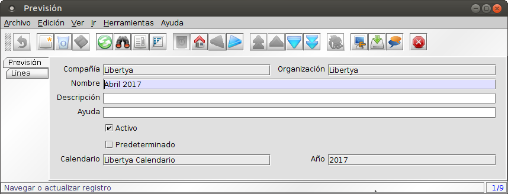
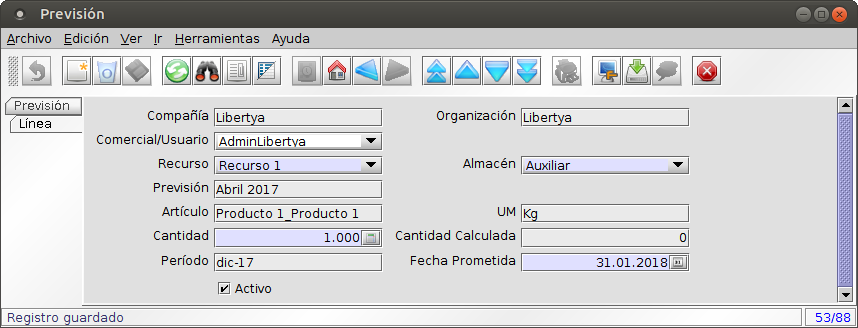

Manufactura - Pronóstico
************************

El Pronóstico permite definir la proyección de la producción que va a tener como entrada el proceso del MRP. Los elementos del pronóstico definen fechas y cantidades necesarias, para cada producto, generalmente a nivel de productos finales, lo que no quita que puedan agregarse pronósticos de productos intermedios. El pronóstico puede tener, una o varias de las siguientes entradas:

* Producción por ventas planificadas
* Producción por ventas regulares
* Producción por ventas estacionales
* Producción por aprovisionamiento
* Otras

Pronóstico - Cabecera
---------------------

1. Acceder a la opción del menú **Gestión de Manufactura →  Gestión de Planificación → Provisión/Pronóstico de Materiales**. El sistema presenta una ventana como lo muestra la Imagen Plan003.
2. Campos a ingresar en la cabecera:
	* **Compañía:** Cliente para esta instalación compañía o entidad legal 
	* **Organización:** Entidad organizacional dentro de la compañía. Una organización es una unidad de la compañía o entidad legal.
	* **Nombre:** Identificador alfanumérico de la entidad. El nombre de una entidad (registro) se usa como una opción de búsqueda predeterminada adicional a la clave de búsqueda. El nombre es de hasta 60 caracteres de longitud. 
	* **Descripción:** Descripción corta opcional del registro Una descripción esta limitada a 255 caracteres.
	* **Ayuda:** El campo Ayuda contiene una sustento, comentario o ayuda acerca de cómo usar este ítem.
	* **Activo:** El registro está activo en el sistema Hay dos métodos para que los registros no estén disponibles en el sistema: Uno es eliminar el registro; el otro es desactivarlo. Un registro desactivado no está disponible para selección; pero está disponible para Informes.
	* **Predeterminado:** Indica si el pronóstico es el predeterminado para la corrida del proceso de MRP.
	* **Calendario:** Calendario de referencia de Libertya.
	* **Año**.
3. Guardar.

Imagen Plan003: Pronóstico

Pronóstico - Detalles
---------------------

1. Acceder a la opción del menú **Gestión de Manufactura →  Gestión de Planificación → Provisión/Pronóstico de Materiales**. El sistema presenta una ventana como lo muestra la Imagen Plan003. Seleccionar pestaña **Línea**, el sistema presenta una ventana como lo muestra la Imagen Plan004.
2. Campos a ingresar:
	* **Compañía:** Cliente para esta instalación compañía o entidad legal 
	* **Organización:** Entidad organizacional dentro de la compañía. Una organización es una unidad de la compañía o entidad legal.
	* **Comercial/Usuario:** Responsable del registro de pronóstico. 
	* **Recurso:** Recurso de tipo Planta donde va a ejecutarse el pronóstico.
	* **Almacén:** Almacén donde va a ejecutarse el pronóstico.
	* **Artículo:** Artículo pedido.
	* **UM:** Unidad de Medida asociada al artículo.
	* **Cantidad:** Cantidad pedida.
	* **Período:** Período del calendario y del año del pronóstico asociado al requerimiento.
	* **Fecha Prometida:** fecha para la cual es necesario el requerimiento.
	* **Activo:** El registro está activo en el sistema Hay dos métodos para que los registros no estén disponibles en el sistema: Uno es eliminar el registro; el otro es desactivarlo. Un registro desactivado no está disponible para selección; pero está disponible para Informes.
3. Guardar

Imagen Plan003: Pronóstico - Líneas

**Nota:** La demanda de producción también puede generarse a través de órdenes de manufactura manuales.