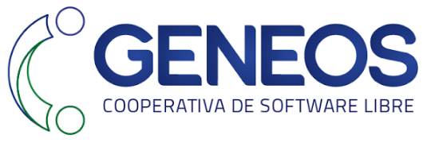

## somos

Una cooperativa conformada por profesionales de la informática, las comunicaciones y el diseño, lo que nos permite trabajar de manera integral en la búsqueda de innovación, la mejora continua y la calidad. Nos dedicamos a implementar proyectos de tecnología, basados en Software Libre, que contribuyan a mejorar y potenciar el modelo de negocios de nuestros clientes.

Ofrecemos nuestra experiencia de más de 15 años desarrollando software para encontrar las mejores soluciones posibles. Contamos además con diversas experiencias en metodología ágiles para la mejora continua, normas y procedimientos, seguridad de la información, posicionamiento en buscadores, presencia digital, publicidad, comunicación y diseño gráfico.

## una cooperativa de trabajo

Entendemos el cooperativismo como la forma de resignificar el trabajo y construir nuevas formas de organización en torno a este. Creemos en el cooperativismo como  un herramienta de transformación, que  permite lograr una manera democrática y participativa de gestionar las formas y objetivos del trabajo de las personas.

## de Tecnología, Innovación y Conocimiento

Nos dedicamos a brindar soluciones informáticas a otras organizaciones, empresas o personas. El trabajo que realizamos consiste en el desarrollo de software, es decir, la creación de sistemas que posibilitan la resolución de una problemática específica. Las cooperativas TICs se dedican al diseño de estas aplicaciones y a garantizar su correcta implementación. Por otro lado, ofrecemos servicio de consultoría o soporte técnico y auditorías sobre los sistemas que una organización ya posee. Otro de los servicios ofrecidos son las capacitaciones a las empresas en el uso de los sistemas.

## basados en Software Libre

El software libre fomenta el trabajo colaborativo mediante comunidades de desarrollo, tiene potencial para dar soluciones y respuestas a todo tipo de requerimientos y no necesita licencias para su uso y desarrollo. Además, posee estándares abiertos y garantiza la seguridad.