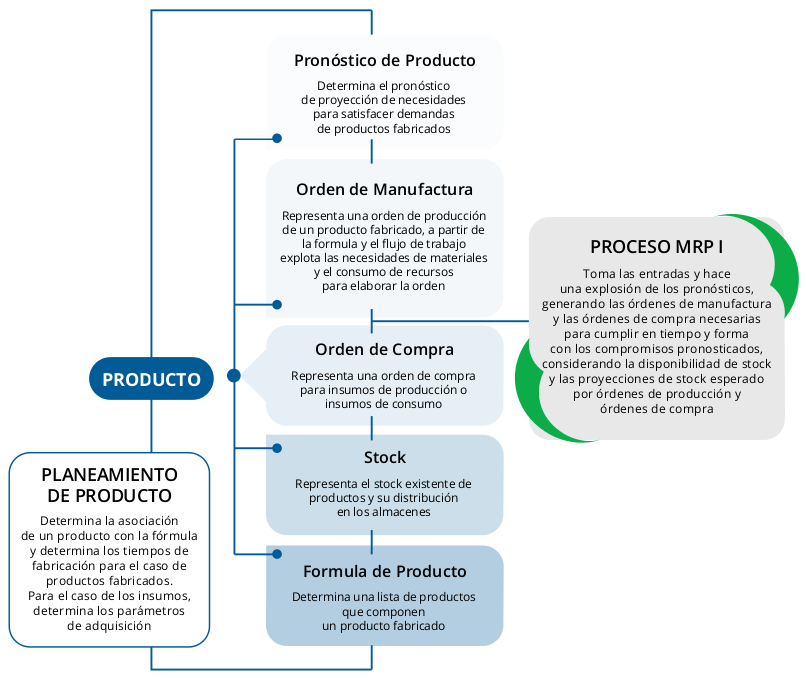

## Módulo de Producción

El módulo de Producción de Libertya tiene dos submódulos complementarios entre sí que permiten diferentes modelos de implementación dependiendo de las necesidades del cliente y l capacidad de gestión de la producción.

El primer submódulo es el de gestión de la producción que permite la administración de la ingeniería de producción, basada en la definición de fórmulas y flujos de trabajo de los productos elaborados, la gestión del stock y de las órdenes de producción.

Complementariamente, puede usarse el submódulo de automatización de la producción, disponiendo para esto de un proceso basado en MRP (Material Resource Planning).

El MRP, consiste esencialmente, en un cálculo de necesidades netas de los artículos (productos terminados, productos intermedios, materias primas) introduciendo un factor nuevo, no considerado en los métodos  tradicionales de gestión de stocks, que es el plazo de fabricación o plazo de entrega en la compra de cada uno de los artículos, lo que en definitiva conduce a modular a lo largo del tiempo las necesidades, ya que indica la oportunidad de fabricar (o aprovisionar) los componentes, con la  debida planificación respecto a su utilización en la fase siguiente de fabricación.

## Datos utilizados por el proceso MRP

### Fuentes principales

1. Plan Maestro detallado de Producción, que nos dice que productos finales hay que fabricar y en que plazos de entrega.
2. Lista de Materiales, indica de que partes o componentes se forma cada unidad de los productos intermedios y terminados, permitiendo calcular las cantidades de cada componente necesarias para fabricarlos.
3. Estado del Stock, permite conocer las cantidades disponibles de cada artículo y por diferencia, las cantidades que deben comprarse.

### Fuentes complementarias

1. Órdenes de Producción en curso, deben considerarse como futuras disponibilidades de producto, siempre y cuando las fechas de finalización de las órdenes coincidan con los plazos en los que se requieren los productos.
2. Órdenes de Compra en curso, deben considerarse como futuras disponibilidades de producto, siempre y cuando las fechas de entrega de las órdenes coincidan con los plazos en los que se requieren los productos.

### Proceso

